<h3><code>whoami</code></h3>

<table>
  <tr>
    <td valign="top"></td>
    <td valign="top"></td>
  </tr>
</table>

 

<h3><code>contributions</code></h3>

  

AI/ML Builder &middot; GDG On Campus Lead @ APSIT &middot; Google Student Ambassador'26

[Portfolio](https://avanish.tech) &nbsp;&middot;&nbsp; [LinkedIn](https://www.linkedin.com/in/avanishkasar) &nbsp;&middot;&nbsp; [Linktree](https://linktr.ee/Avanish_Kasar) &nbsp;&middot;&nbsp; [Email](mailto:avanishkasar57@gmail.com)

<!--
Regenerate locally:
  python scripts/make_ascii_svg.py        # avi-ascii.svg   (static wordmark, run only when text changes)
  python scripts/make_info_card.py        # info-card.svg   (static, run only when details change)
  python scripts/fetch_contributions.py   # data/contributions.json (real data, no token)
  python scripts/render_heatmap_svg.py    # contrib-heatmap.svg (run daily via GitHub Actions)
-->
